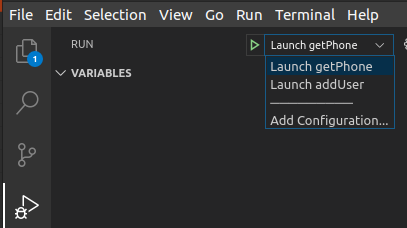

# axl-dotnet-samples

## Overview

These C# samples demonstrate how to use the DotNet SoapCore package to read/update CUCM configurations with the AXL SOAP API.

[https://developer.cisco.com/site/axl/](https://developer.cisco.com/site/axl/)

The concepts and techniques shown can be extended to enable automated management of virtually any configuration or setting in the CUCM admin UI.

**Tested using:**

* Ubuntu 20.04
* DotNet Core 3.1
* CUCM 12.5
* Visual Studio Code

Try this out in the [DevNet Sandbox Collaboration 12.5 lab](https://devnetsandbox.cisco.com/RM/Diagram/Index/97563de1-5ace-4c0c-a03b-0f3eaae59d75?diagramType=Topology)

## Available samples

* `getPhone.cs` - Executes a `<getPhone>` request and displays the response (`<getPhone>`)

* `addUser.cs` - Adds a simple end user, then deletes the user (`<addUser>`, `<removeUser>`)

## Getting started

* From a terminal, use `git` to clone this repo to your PC, then change into the new directory:

    ```bash
    git clone https://www.github.com/CiscoDevNet/axl-dotnet-samples
    cd axl-dotnet-samples
    ```

* Install the DotNet Core SDK 3.1:

    ```bash
    sudo apt install dotnet-sdk-3.1
    ```

* Install the `dotnet-svcutil` utility for generating SOAP client code from WSDL files (requires DotNet Core 2.1)

    ```bash
    sudo apt instasll dotnet-sdk-2.1
    dotnet tool install --global dotnet-svcutil
    ```

* This project includes the AXL WSDL files for CUCM 12.5.  If you wish to use another version:

    * From the CUCM admin pages, navigate to **Applications** / **Plugins**, click **Find** and download the "Cisco AXL Toolkit":

        

    * Extract the .zip file.  From the appropriate version directory under `schema/`, copy the `AXLAPI.wsdl`, `AXLEnums.xsd`, and `AXLSoap.xsd` files to the `schema/` directory under this project

* Some limitations of WCF or quirks in the AXL schema/implementation may require tweaks to the AXL WSDL schema files prior to generating client code.

    See `quirks.sh` to see if any of these issues apply for the requests you may be using, and either perform the tweaks manually, or simply execute the script to apply all of them:

    ```bash
    ./quirks.sh
    ```

* Use `dotnet-svcutil` to generate the AXL client code.  From the project root:

    ```bash
    ~/.dotnet/tools/dotnet-svcutil --outputDir AXLClient  --outputFile AXLClient --namespace *,AXLClient schema/AXLAPI.wsdl
    ```

* Install the AXL web service HTTPS certificate:

    * Download the certificate from your target CUCM server:

        ```bash
        echo -n | openssl s_client -connect ds-ucm1251.cisco.com:8443 | sed -ne '/-BEGIN CERTIFICATE-/,/-END CERTIFICATE-/p' > cucm.crt
        ```

    * Copy it to the local certificate trust store directory:

        ```bash
        sudo cp cucm.crt /usr/local/share/ca-certificates/
        ```

    * Update the OS certificate trust list:

        ```bash
        sudo update-ca-certificates
        ```

* Install needed DotNet dependencies:

    ```bash
    dotnet restore
    ```

* Open the project directory in Visual Studio Code:

    ```bash
    code .
    ```

* Rename `.env.example` to `.env`, and edit it to specify your CUCM address and AXL user credentials (be sure to save the file!)

* To run a specific sample, open the **Run** tab in VS Code, select the sample from the launch dropdown, and click the green **Start Debugging** arrow (or press **F5**)

    

## Hints

* To enable printing debug output of the XML request/response, set `Debug=True` in `.env`

* When constructing request objects, it can be difficult to discern the names of elements that represent `xsd:choice` options, for example `<name>` and `<uuid>` in `<getPhone>`:

    

    SoapCore models these options by creating `ItemElementName` elements with arbitarily assigned type numbers, e.g.: `ItemChoiceType142`

    Intellisense can help greatly in figuring out which of these similarly-named elements belong to a particular parent element:

    

    Peeking into the auto-generated AXL client file (`AXLClient/AXLClient.cs`) can also be informative:

    

